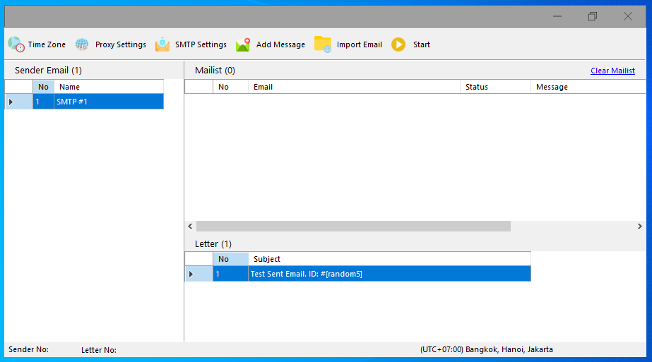

# AnonSender
AnonSender is a tool for bulk send email and have a lot of features, so you can having fun with it!



## Replacer
To replace some words to something we have, you can easily use this.
It Works for Email Body, Subject, From Email and even From Name!

```
[24hour]
- Get Time with format HH:mm:ss
    
[12hour]
- Get Time with format hh:mm:ss

[minute]
- Get minutes time

[second]
- Get second time

[day]
- Get day time (format: dddd)

[month]
- Get month time (format: MMMM)

[year]
- Get year time (format: yyyy)

[fulldatetime]
- Get full datetime time (format: MMMM dd, yyyy, HH:mm:ss tt)

[fulldatetime1]
- Get full datetime time (format: dd/mm/yyyy, HH:mm:ss tt)

[fulldate]
- Get full date time (format: ddd, mm dd, yyyy)

[fulldate1]
- Get full date time (format: dd/mm/yyyy)

[email]
- Get email receiver

[random5]
- Generate alphabet. length = 5

[random50]
- Generate alphabet. length = 50

[emailtobase64]
- Encode email receiver to base64

[emailusername]
- Get username from email receiver. Example: anonsender@firdy.dev => anonsender

[domainuc]
- Get domain of email receiver with uppercase in first word. Example: anonsender@firdy.dev => Dev

[domain]
- Get domain of email receiver. Example: nonsender@firdy.dev => dev

[dotdomain]
- Get domain of email receiver with dot (.). Example: nonsender@firdy.dev => .dev
```

## Donations
https://paypal.me/itsfirdy

## Credits
Icons: https://www.flaticon.com/
Email Library: http://www.mimekit.net/
